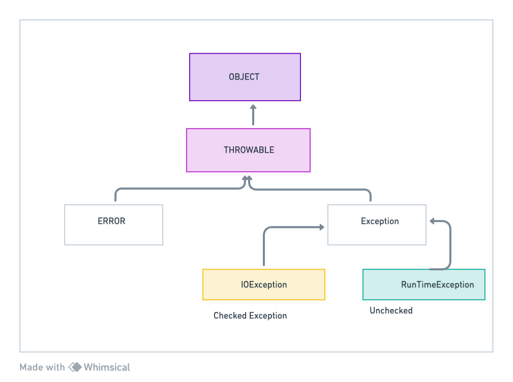

# Exception & Errors 
Both exceptions and errors in java is child of thorwable
## Error 
Condition may occur during execution, you should not try to catch 
them. 
Example - OutOfMemory 

## Exceptions
Exception are the abbormal condition which may come during program execution
when exception occurs, it interrupts  normal flow of execution 
and jumps to handler, if no handler is defined it will bubble out till
it reaches to JVM,

To handle exception we use try -catch 

```java
class A {
    public void doSomething(){
        try{
            
        }catch (Exception ex){
            //optional if finally added 
        }
        finally {
            // Optional 
        }
    }
}
```

## Lambdas 
Java 8 support functional programming using lambdas. Concept of Functional.
Functional Interface  is the with only one abstract method 

Example 
```java
@FunctionalInterface
public interface Run {
    void run();
}
```
Lambdas expressions are the inline implementation of the methods in functional interface. 